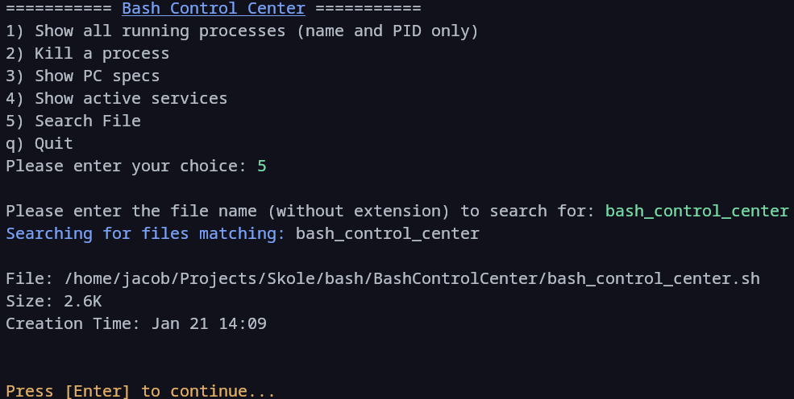

# Bash Control Center
> [!NOTE]
> This project was for a school assignment to practice Bash

A simple Bash script that provides an interactive control center for system tasks see [features](#features) for more information.
## 📷 Showcase

___

## 🔧 Setup

1. Clone the repository:
    ```bash
    git clone https://github.com/Zelvios/BashControlCenter
    ```

2. Navigate to the project directory:
    ```bash
    cd BashControlCenter
    ```
3. Make the script executable:
    ```bash
    chmod +x bash_control_center.sh
    ```
4. Run the script
    ```bash
    ./bash_control_center.sh
    ```


## Features

- **Interactive Menu**: Easy-to-use menu system for selecting tasks.
- **View Running Processes**: Lists all running processes with their names and PIDs.
- **Kill Processes**: Allows you to safely kill processes by their PID with confirmation.
- **System Specs**: Displays CPU model and storage information.
- **Active Services**: Lists all active system services.
- **File Search**: Search for files by name with details about their size and creation time.
